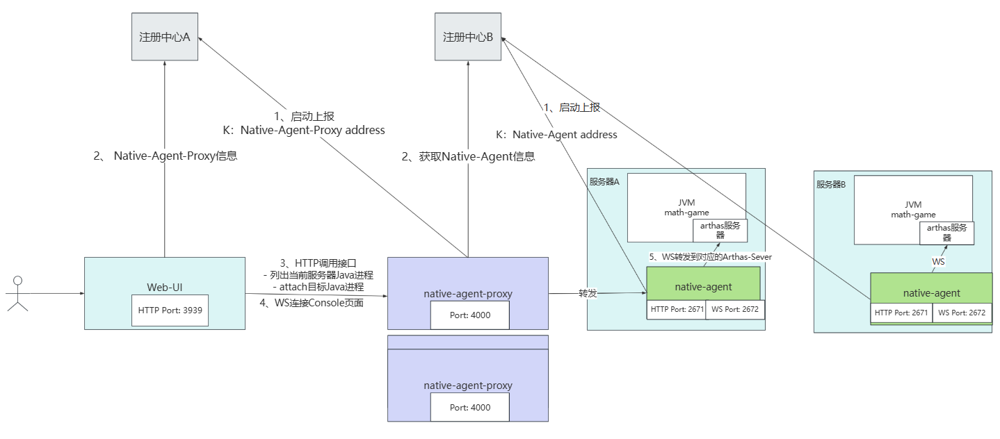
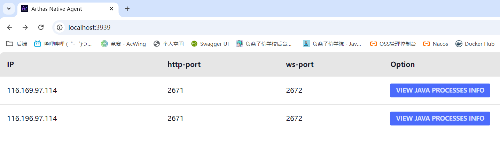
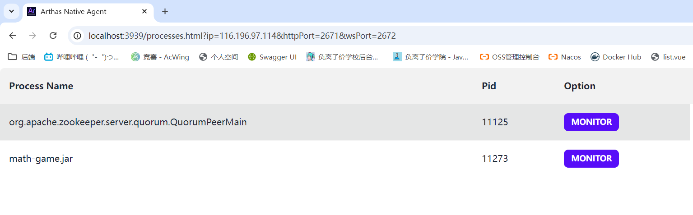
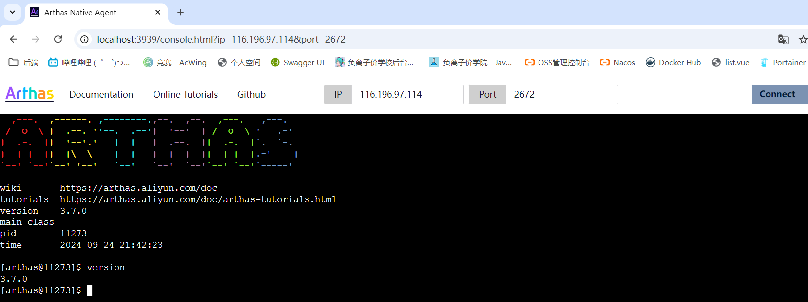

## JAD Native Agent - 
 


# 

## native-agent
native-agent，attach


|                    |   |                                   |
|----------------------|-----|-------------------------------------|
| http-port            | N   | http ，2671                      |
| ws-port              | N   | ws，2672                         |
| registration-typ     | Y   | （etcdzookeeper,etcd） |
| registration-address | Y   |                              |

example：
```shell
java -jar native-agent.jar --ip 164.196.97.123 --http-port 2671 --ws-port 2672 --registration-type etcd --registration-address 164.196.97.123:2379
```

## native-agent-proxy
native-agentnative-agent-management-web

|                               |   |                                                                |
|---------------------------------|-----|------------------------------------------------------------------|
| port                            | N   | http/ws ，2233                                                |
| ip                              | Y   | proxyip                                                         |
| management-registration-type    | Y   | native-agent-manangement-web（etcdzookeeper,etcd） |
| management-registration-address | Y   | native-agent-manangement-webd                             |
 | agent-registration-type         | Y   | native-agent（etcdzookeeper,etcd）                 | 
 | agent-registration-address      | Y   | native-agent                                              | 


example:
```shell
java -jar native-agent-proxy.jar --ip 164.196.97.123 --management-registration-type etcd --management-registration-address 164.196.97.123:2379 --agent-registration-type etcd --agent-registration-address 164.196.97.123:2379
```

## native-agent-management-web
native-agent

|                    |   |                                   |
|----------------------|-----|-------------------------------------|
| port                 | N   | http ，3939                      |
| registration-typ     | Y   | （etcdzookeeper,etcd） |
| registration-address | Y   |                              |


example:
```shell
java -jar native-agent-management-web.jar  --registration-type etcd --registration-address 164.196.97.123:2379
```


## JVM
native-agent-server，VIEW JAVA PROCESS INFO ，Java

Java，Monitor，MonitorJava

MONITOR


# 
zookeeperetcd，，。native-agent-management-web，。

com.akshita.jad.nat.agent.management.web.discovery.NativeAgentProxyDiscovery，META-INF/jad/com.akshita.jad.native.agent.management.web.NativeAgentProxyDiscoveryFactory 
```properties
zookeeper=com.akshita.jad.nat.agent.management.web.discovery.impl.ZookeeperNativeAgentProxyDiscovery
etcd=com.akshita.jad.nat.agent.management.web.discovery.impl.EtcdNativeAgentProxyDiscovery
=
```
# 
=
native-agent-management-web，--registration-type，
```shell
java -jar native-agent-management-web.jar --registration-type  --registration-address 
```
