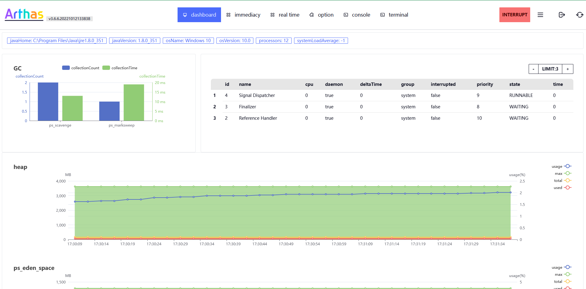
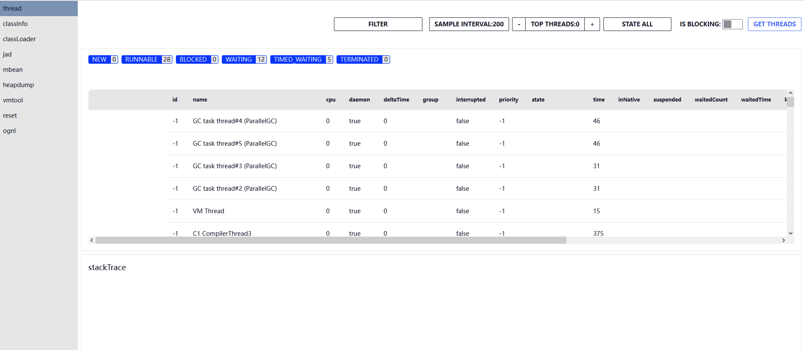
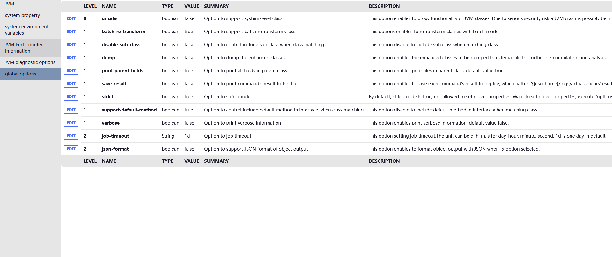

#  http api   jad 

[English](./README.md)|[](README_ZH.md)

## usage

- ，
-  sessionID ，。， sessionid 。， /  sessionID
-  interrupt ，（dashboard  real time ）。，
- ：/index.html ( web terminal), /ui/index.html ()
- cli，（jad）

### 

#### dashboard



-  dashboard 
-  memory ，
-  gc  (？)
-  threads ， limit  n 

#### real time

- ， sessionID
- `tt`, `monitor` cost/RT

##### tt

- all records 
-  index ，invoke，
- search records Advice ，`method.name=="print"`

#### immediacy

- ，  sessionID
-  refresh 

##### thread



- thread ， history  ，get threads thread

###### filter: 

```shell
:

:
  id:-1 // id = -1 
```

- ， `=`
- ~~，bug~~

###### top thread

- 
- 0 

#### option



- 
- （，osName）

#### console

- ， http api 
-  init sessionID 

#### terminal

-  websocket  Web 

## 

-  vscode ,  vscode  xstate 
- TS + Vue3 + Tailwindcss  + daisyui + xstate
- dist,  ant   `../target/static`

### 

-  pull_results ，， ```sc class```
- consoleMachine.ts  perRequestMachine.ts ，@vue/state

### 

- [ ] ， 
- [ ] 
